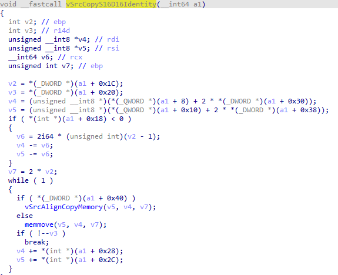

# CVE-2023-21822 Win32k EoP

This is recreation of great blogpost on ZDI ([link](https://www.thezdi.com/blog/2023/8/1/exploiting-a-flaw-in-bitmap-handling-in-windows-user-mode-printer-drivers)).

## Exploitation notes

It reuses code inside **win32kfull** for achieving read-write capabilities. Particular **vSrcCopyS16D16Identity**. This handy function, has single argument and can be semantically interpretered as memmove. In test environment no CFG was enabled, that means i could use **memmove** directly but I wished to deal with restriction to win32kfull module.



## Build

```shell
    cd cve-2023-21822
    cmake -S . -B build
    cmake --build build --config Release
```

## Machine systeminfo

```shell
Host Name:                 DESKTOP-19NG2CS
OS Name:                   Microsoft Windows 10 Education
OS Version:                10.0.19045 N/A Build 19045
OS Manufacturer:           Microsoft Corporation
OS Configuration:          Standalone Workstation
OS Build Type:             Multiprocessor Free
Registered Owner:          Windows User
Registered Organization:
Product ID:                00328-00000-00000-AA110
Original Install Date:     27/03/2023, 14:36:49
System Boot Time:          03/12/2023, 07:28:45
System Manufacturer:       VMware, Inc.
System Model:              VMware20,1
System Type:               x64-based PC
Processor(s):              1 Processor(s) Installed.
                           [01]: Intel64 Family 6 Model 165 Stepping 5 GenuineIntel ~3792 Mhz
BIOS Version:              VMware, Inc. VMW201.00V.21805430.B64.2305221830, 22/05/2023
Windows Directory:         C:\Windows
System Directory:          C:\Windows\system32
Boot Device:               \Device\HarddiskVolume1
System Locale:             en-gb;English (United Kingdom)
Input Locale:              en-gb;English (United Kingdom)
Time Zone:                 (UTC+03:00) Kuwait, Riyadh
Total Physical Memory:     2,047 MB
Available Physical Memory: 737 MB
Virtual Memory: Max Size:  3,199 MB
Virtual Memory: Available: 1,927 MB
Virtual Memory: In Use:    1,272 MB
Page File Location(s):     C:\pagefile.sys
Domain:                    WORKGROUP
Logon Server:              \\DESKTOP-19NG2CS
Hotfix(s):                 6 Hotfix(s) Installed.
                           [01]: KB5017022
                           [02]: KB5015684
                           [03]: KB5022282
                           [04]: KB5014032
                           [05]: KB5016705
                           [06]: KB5020372
Network Card(s):           1 NIC(s) Installed.
                           [01]: Bluetooth Device (Personal Area Network)
                                 Connection Name: Bluetooth Network Connection
                                 Status:          Media disconnected
Hyper-V Requirements:      A hypervisor has been detected. Features required for Hyper-V will not be displayed.
```
