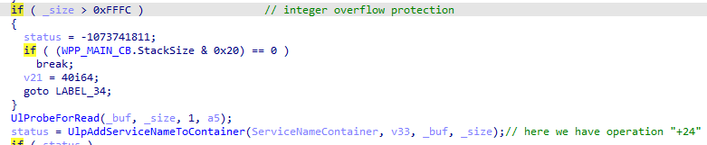
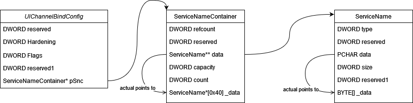
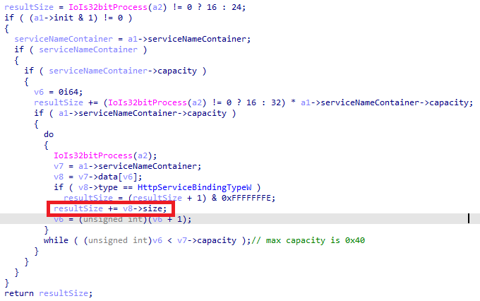
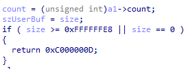
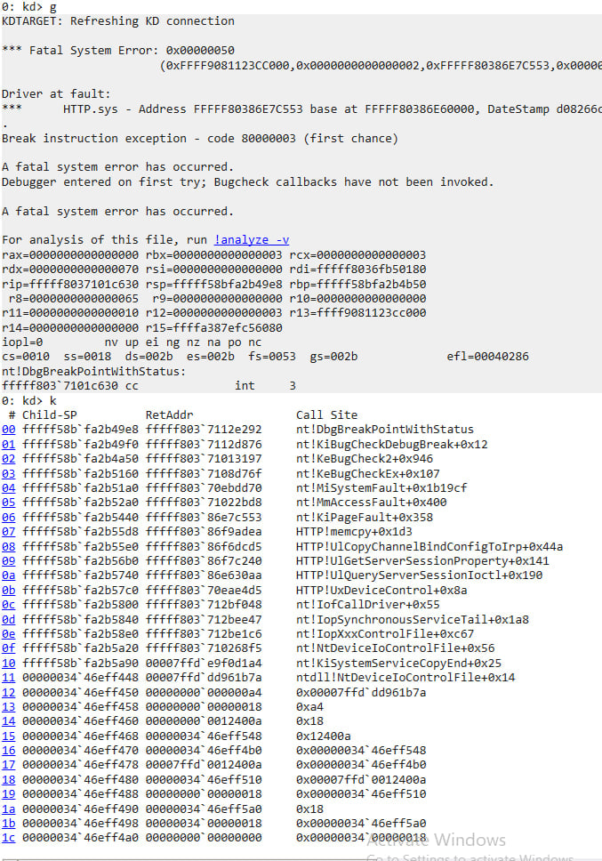

# CVE-2023-2341 HTTP.SYS EoP

We can trigger an integer overflow in **UlpComputeChannelBindConfigSize** which can lead to memory corruption in **UlCopyChannelBindConfigToIrp**. Patch introduced a new check for size of *ServiceName*. That check prevent size to be greater than **0xFFFC**.

An introduced check was placed in **UlCaptureChannelBindConfig**.


That function can be reached by followed usermode **API** from **httpapi.dll**.

- [HttpSetServerSessionProperty](https://learn.microsoft.com/en-us/windows/win32/api/http/nf-http-httpsetserversessionproperty)
- [HttpSetUrlGroupProperty](https://learn.microsoft.com/en-us/windows/win32/api/http/nf-http-httpseturlgroupproperty)
- [HttpSendHttpResponse](https://learn.microsoft.com/en-us/windows/win32/api/http/nf-http-httpsendhttpresponse)

Memory layout of considered structures


**UlpComputeChannelBindConfigSize** computes the total size of memory required for all *ChannelBindConfig* structure. We can craft a specific sequence of *ServiceName* structures which can overflow **resultSize** variable.



But we should beware about few more check.

- Check in **UlpAddServiceNameToContainer** which prevent size to be greater or equal than **0xffffffe8**.
  
  

- Size of ServiceName should be aligned to 8.

## Stack Trace



## Build

```shell
    cd cve-2023-23410
    cmake -S . -B build
    cmake --build build --config Release
```
