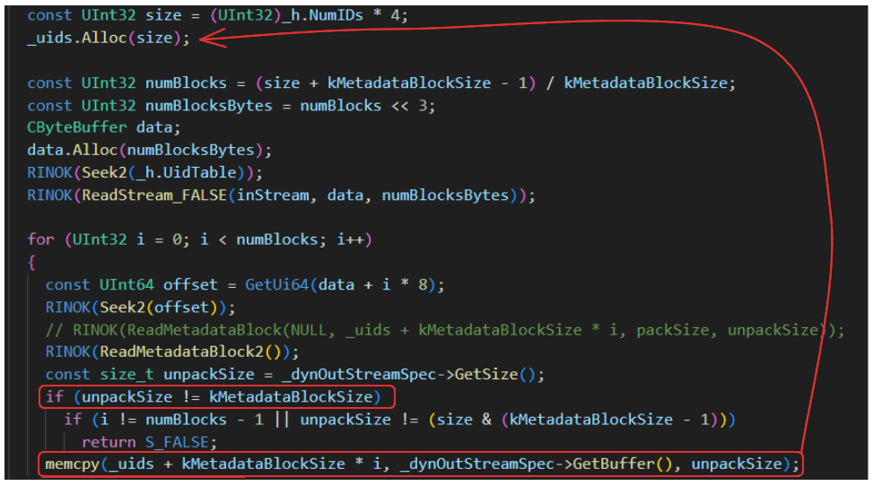
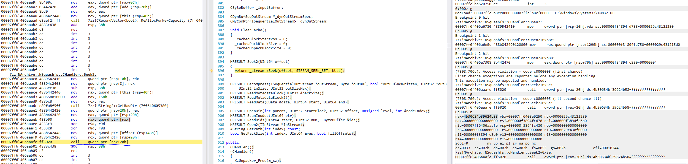

# CVE-2023-40481 7-Zip SquashFS Heap Buffer Overflow

*poc.squashfs* synthesized SquashFS which might lead to heap buffer overflow inside 7-Zip. We can trigger an overflow in **CHandler::Open2** (SquashfsHandler.cpp) particularly inside memcpy at line *1695*. If size of metadata block associated with *id_table* is equal to size of squashfs_block (8192 bytes) the check which should prevent that overflow wont be performed.

Full feature exploit is possible but very unreliable due to heap mitigations and source code structure. A few allocations only available before vulnerability will be triggered. It is not enough to setup heap determinism.

